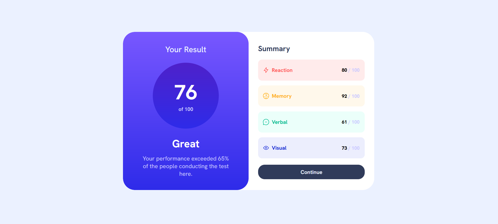

# Frontend Mentor - Results summary component solution

This is a solution to the [Results summary component challenge on Frontend Mentor](https://www.frontendmentor.io/challenges/results-summary-component-CE_K6s0maV).

## Table of contents

- [Process](#process)
- [Screenshot](#screenshot)
- [What I learned](#what-i-learned)
- [Continued development](#continued-development)
- [Author](#author)

## Process

I attempted to organise the core of the HTML in a way that was as "semantic"
as possible. I used SASS in this project. For the layout, I used a combination
of CSS Grid / Flexbox.

## Screenshot

;

## What I learned

**Structuring the background-image linear-gradient**

The code below is the way to aesthetically structure the code
for the linear-gradient tied to a background image, as its
easier to read.

```
        background-image: linear-gradient(
          to bottom,
          $light__slate__blue,
          $light__royal__blue
        );
```

**The different ways of writing grid-template-areas**

Side-by-side:
```
  grid-template-areas: "card__left card__right";
```
Top down:
```
        grid-template-areas: 
        "card__left"
        "card__right";
```

## Continued development

I could revist this project with intent of using the data.json 
file. It could operate in a way where it generated the test results
randomly, and every time one refreshed the page these results could 
change what appeared in the GUI. 

## Author 

Dilhan Boca

- Frontend Mentor - [@dboca93](https://www.frontendmentor.io/profile/dboca93)
- Twitter - [@dboca93](https://www.twitter.com/dboca93)

dboca93@gmail.com